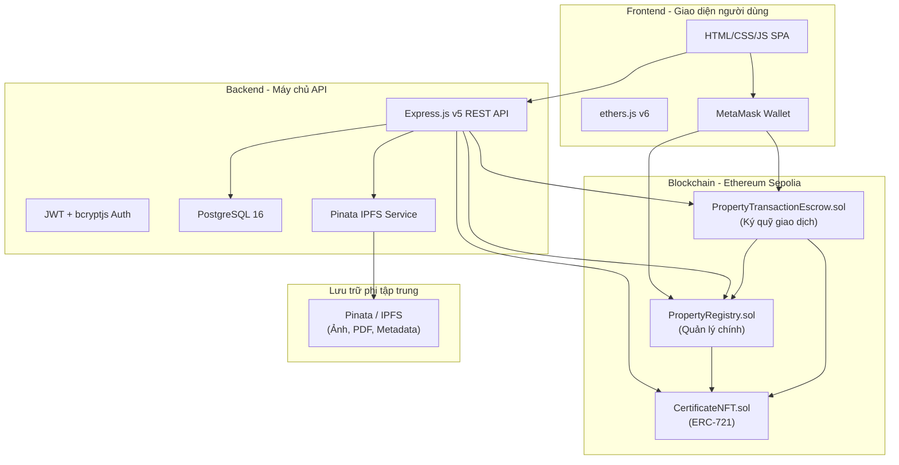
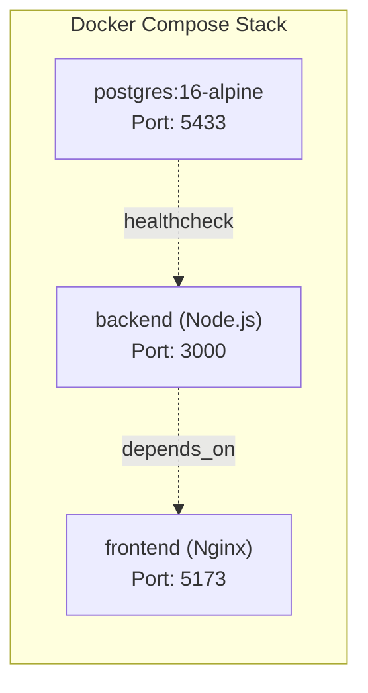
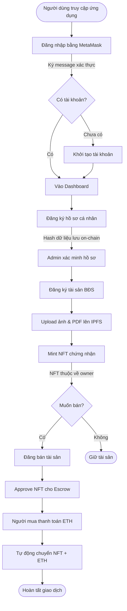
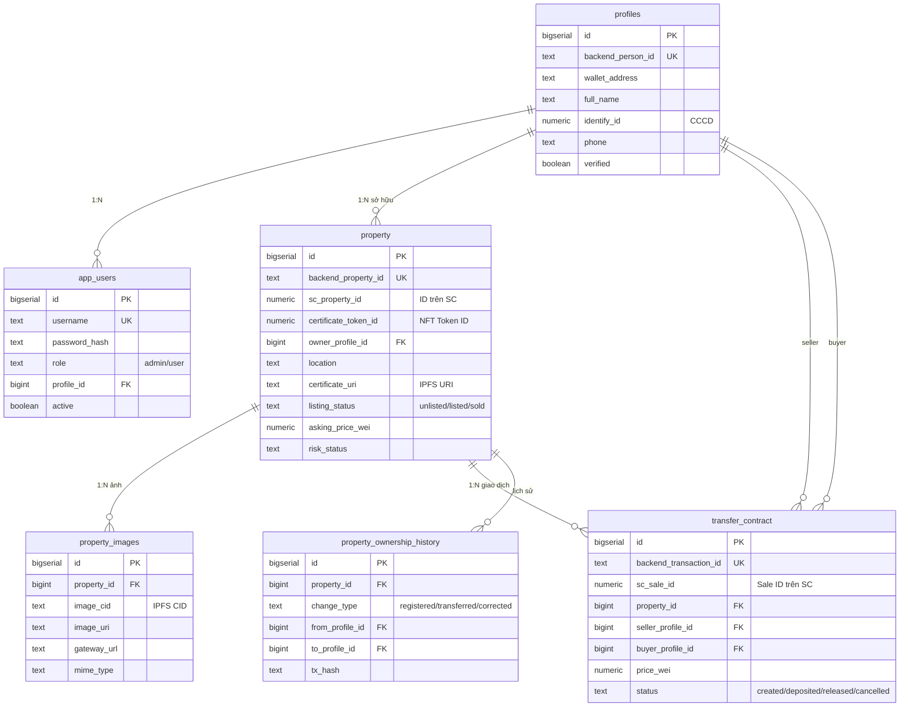
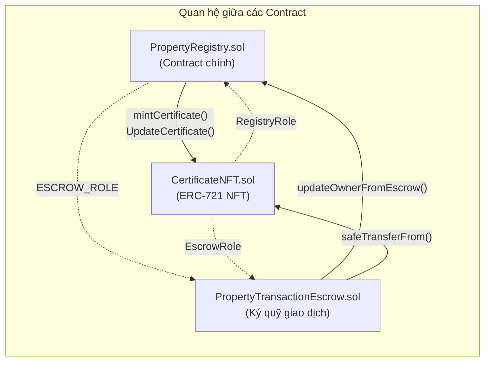
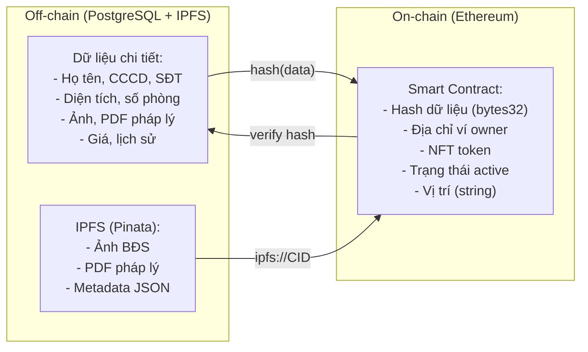

# 📋 BÁO CÁO CÔNG NGHỆ DỰ ÁN — PropertyRegistryNFT
## Hệ thống Đăng ký & Chuyển nhượng Bất động sản trên Blockchain

---

## 1. Tổng quan dự án

**PropertyRegistryNFT** là một hệ thống ứng dụng phi tập trung (DApp) cho phép **đăng ký, xác thực quyền sở hữu và chuyển nhượng bất động sản** thông qua công nghệ blockchain. Mỗi bất động sản được đại diện bởi một **NFT (Non-Fungible Token)** — giấy chứng nhận kỹ thuật số không thể giả mạo, lưu trữ vĩnh viễn trên blockchain Ethereum.

> [!IMPORTANT]
> Hệ thống kết hợp **on-chain** (smart contract trên Ethereum) và **off-chain** (backend PostgreSQL + IPFS) để đảm bảo cả tính minh bạch lẫn khả năng mở rộng.

---

## 2. Kiến trúc tổng thể



---

## 3. Công nghệ sử dụng

### 3.1 Frontend (Giao diện người dùng)

| Công nghệ | Phiên bản | Mục đích |
|---|---|---|
| **HTML5** | - | Cấu trúc trang, SPA (Single Page Application) với hash routing (`#/home`, `#/profile`...) |
| **CSS3** | - | Giao diện hiện đại với glassmorphism, gradient, micro-animation |
| **Vanilla JavaScript** | ES6+ | Logic ứng dụng toàn bộ trong [app.js](file:///d:/Blockchain/frontend/app.js) (~133KB) |
| **ethers.js** | v6 (UMD) | Thư viện tương tác với Ethereum blockchain, ký giao dịch, gọi smart contract |
| **MetaMask** | Browser Extension | Ví Web3 để ký giao dịch và xác thực danh tính |
| **Nginx** | Alpine | Web server phục vụ static files trong Docker |

#### Các trang chính của Frontend:

| Trang | Route | Chức năng |
|---|---|---|
| Tổng quan | `#/home` | Dashboard tổng quan tài sản, giao dịch |
| Profile | `#/profile` | Thông tin cá nhân của user đang đăng nhập |
| Cá nhân | `#/profiles` | Quản lý danh sách hồ sơ cá nhân (Admin) |
| Bất động sản | `#/properties` | Danh sách tài sản, tạo mới, xem chi tiết |
| Giao dịch | `#/transfers` | Quản lý mua bán, chuyển nhượng |
| Sổ giao dịch | `#/ledger` | Lịch sử giao dịch & quyền sở hữu |
| Xác thực | `#/verify` | Xác thực quyền sở hữu tài sản |
| Quản trị | `#/system` | Cấu hình hệ thống (chỉ Admin) |

---

### 3.2 Backend (Máy chủ API)

| Công nghệ | Phiên bản | Mục đích |
|---|---|---|
| **Node.js** | Runtime | Môi trường chạy JavaScript phía server |
| **Express.js** | v5.2.1 | Framework REST API |
| **PostgreSQL** | 16 (Alpine) | Cơ sở dữ liệu quan hệ lưu trữ chi tiết off-chain |
| **pg** (node-postgres) | v8.21.0 | Driver kết nối PostgreSQL |
| **ethers.js** | v6.16.0 | Tương tác smart contract từ backend (admin signer) |
| **jsonwebtoken** (JWT) | v9.0.3 | Xác thực phiên đăng nhập bằng token |
| **bcryptjs** | v3.0.3 | Mã hóa mật khẩu |
| **multer** | v2.1.1 | Xử lý upload file (ảnh, PDF) |
| **cors** | v2.8.6 | Cho phép cross-origin requests |
| **dotenv** | v17.4.2 | Quản lý biến môi trường |
| **Pinata API** | Cloud | Upload file lên IPFS thông qua Pinata |

#### File chính:

| File | Chức năng |
|---|---|
| [server.js](file:///d:/Blockchain/backend/src/server.js) | Server chính, chứa toàn bộ REST API (~2435 dòng) |
| [db.js](file:///d:/Blockchain/backend/src/db.js) | Kết nối pool PostgreSQL, hỗ trợ transaction |
| [contracts.js](file:///d:/Blockchain/backend/src/services/contracts.js) | Service tương tác smart contract (load ABI, tạo signer) |
| [ipfs.js](file:///d:/Blockchain/backend/src/services/ipfs.js) | Service upload file/JSON lên IPFS qua Pinata |
| [schema.sql](file:///d:/Blockchain/backend/PostgreSQL/schema.sql) | Schema cơ sở dữ liệu PostgreSQL |

---

### 3.3 Blockchain & Smart Contracts

| Công nghệ | Chi tiết |
|---|---|
| **Mạng** | Ethereum Sepolia Testnet (Chain ID: `11155111`) |
| **Ngôn ngữ** | Solidity `>=0.8.0 <0.9.0` |
| **Thư viện** | OpenZeppelin Contracts (AccessControl, ERC721URIStorage, ReentrancyGuard) |
| **RPC Provider** | Infura |
| **Chuẩn NFT** | ERC-721 (mỗi NFT là duy nhất, đại diện 1 bất động sản) |

---

### 3.4 Lưu trữ phi tập trung (IPFS)

| Thành phần | Chi tiết |
|---|---|
| **Pinata** | Dịch vụ pinning IPFS (upload & lưu trữ) |
| **IPFS Gateway** | `https://gateway.pinata.cloud/ipfs/` |
| **Dữ liệu lưu** | Ảnh bất động sản, tài liệu PDF pháp lý, metadata JSON (NFT) |
| **Giới hạn** | 10MB mỗi file upload |

---

### 3.5 Hạ tầng triển khai (DevOps)

| Công nghệ | Mục đích |
|---|---|
| **Docker** | Container hóa toàn bộ ứng dụng |
| **Docker Compose** | Orchestration 3 services: `postgres`, `backend`, `frontend` |



---

## 4. Quy trình người dùng (User Flow)

### 4.1 Quy trình tổng quan



### 4.2 Đầu vào — Đầu ra chi tiết

#### 🔐 Bước 1: Đăng nhập & Xác thực

| | Chi tiết |
|---|---|
| **Đầu vào** | Địa chỉ ví MetaMask, chữ ký message xác thực (không tốn gas) |
| **Xử lý** | Backend tạo nonce → User ký bằng MetaMask → Backend xác minh chữ ký → Cấp JWT token |
| **Đầu ra** | JWT token phiên đăng nhập (hết hạn 7 ngày), thông tin user (role, profile) |

#### 👤 Bước 2: Đăng ký hồ sơ cá nhân

| | Chi tiết |
|---|---|
| **Đầu vào** | Họ tên, quốc gia, CCCD/CMND, số điện thoại, email, địa chỉ, ví MetaMask |
| **Xử lý** | Lưu chi tiết vào PostgreSQL → Hash dữ liệu → Gọi `RegisterPerson()` trên smart contract |
| **Đầu ra** | Hồ sơ cá nhân trong DB, bản ghi hash on-chain (`Person` struct), event `PersonRegistered` |

#### 🏠 Bước 3: Đăng ký tài sản bất động sản

| | Chi tiết |
|---|---|
| **Đầu vào** | Vị trí, diện tích, số phòng, ảnh BĐS, tài liệu pháp lý (PDF), báo cáo thẩm định (PDF) |
| **Xử lý** | Upload ảnh/PDF lên IPFS (Pinata) → Tạo metadata JSON → Upload metadata lên IPFS → Gọi `registerProperty()` trên smart contract → Tự động mint NFT |
| **Đầu ra** | Bản ghi property trong DB, NFT (ERC-721) sở hữu bởi owner, `certificateURI` trỏ đến metadata IPFS |

#### 💰 Bước 4: Đăng bán & Giao dịch

| | Chi tiết |
|---|---|
| **Đầu vào (Seller)** | Property ID, giá bán (Wei/ETH), ký chấp thuận giao dịch |
| **Đầu vào (Buyer)** | Thanh toán ETH (giá + 1% phí giao dịch) |
| **Xử lý** | Seller approve NFT cho Escrow → Tạo listing → Buyer gọi `buyCertificate()` → Contract tự động: chuyển NFT cho buyer, gửi ETH cho seller, phí cho admin |
| **Đầu ra** | NFT chuyển sang buyer, ETH chuyển sang seller, 1% phí → admin, cập nhật owner trong Registry, lịch sử giao dịch |

---

## 5. Cơ sở dữ liệu PostgreSQL — Các bảng chính



Ngoài ra còn các bảng phụ trợ:
- **`contract_deployments`** — Lưu địa chỉ & ABI version của smart contract đã deploy
- **`contract_event_logs`** — Ghi lại event từ blockchain
- **`activity_logs`** — Log hoạt động của user

---

## 6. REST API — Các nhóm endpoint chính

### 6.1 Authentication (`/api/auth/*`)

| Method | Endpoint | Chức năng |
|---|---|---|
| GET | `/api/auth/setup-status` | Kiểm tra đã có admin chưa |
| POST | `/api/auth/wallet/nonce` | Tạo nonce cho ví xác thực |
| POST | `/api/auth/wallet/login` | Đăng nhập bằng chữ ký ví |
| POST | `/api/auth/setup-wallet` | Khởi tạo admin bằng ví |
| POST | `/api/auth/setup` | Khởi tạo tài khoản admin đầu tiên |
| POST | `/api/auth/login` | Đăng nhập username/password |
| GET | `/api/auth/me` | Lấy thông tin user hiện tại |
| GET | `/api/auth/users` | Danh sách users (Admin) |
| POST | `/api/auth/users` | Tạo user mới (Admin) |
| PATCH | `/api/auth/users/:id/active` | Kích hoạt/tạm ngưng user (Admin) |

### 6.2 Profiles (`/api/profiles/*`)

| Method | Endpoint | Chức năng |
|---|---|---|
| GET | `/api/profiles` | Danh sách hồ sơ cá nhân |
| POST | `/api/profiles` | Tạo hồ sơ mới + ghi on-chain |
| PATCH | `/api/profiles/:id/verification` | Xác minh hồ sơ (Admin) |
| POST | `/api/profiles/:id/ekyc` | eKYC xác thực danh tính |

### 6.3 Properties (`/api/properties/*`)

| Method | Endpoint | Chức năng |
|---|---|---|
| GET | `/api/properties` | Danh sách tài sản |
| POST | `/api/properties` | Tạo tài sản + mint NFT on-chain |
| PATCH | `/api/properties/:id/blockchain` | Cập nhật thông tin blockchain |
| PATCH | `/api/properties/:id/listing` | Đăng bán / hủy đăng bán |
| PATCH | `/api/properties/:id/risk` | Đánh dấu rủi ro (Admin) |
| PATCH | `/api/properties/:id/certificate-uri` | Cập nhật certificate URI |
| GET | `/api/properties/:id/images` | Lấy ảnh tài sản |
| POST | `/api/properties/:id/images` | Upload ảnh lên IPFS |
| POST | `/api/properties/:id/metadata` | Tạo/cập nhật metadata IPFS |

### 6.4 Transfers (`/api/transfers/*`)

| Method | Endpoint | Chức năng |
|---|---|---|
| GET | `/api/transfers` | Danh sách giao dịch |
| POST | `/api/transfers` | Tạo giao dịch mới |
| POST | `/api/transfers/purchase` | Mua trực tiếp |
| PATCH | `/api/transfers/:id/seller-signature` | Seller ký xác nhận |
| PATCH | `/api/transfers/:id/sale` | Cập nhật sale info |
| PATCH | `/api/transfers/:id/deposit` | Ký gửi NFT |
| PATCH | `/api/transfers/:id/release` | Giải phóng giao dịch |
| PATCH | `/api/transfers/:id/cancel` | Hủy giao dịch |
| GET | `/api/transfers/:id/seller-message` | Lấy message seller cần ký |

### 6.5 Blockchain Direct (`/api/blockchain/*`)

| Method | Endpoint | Chức năng |
|---|---|---|
| GET | `/api/blockchain/status` | Trạng thái kết nối blockchain |
| GET | `/api/blockchain/registry/properties/:id` | Đọc property từ SC |
| GET | `/api/blockchain/registry/ownership/:id/:account` | Xác thực ownership on-chain |
| GET | `/api/blockchain/nft/:tokenId` | Thông tin NFT |
| GET | `/api/blockchain/escrow/sales/:saleId` | Thông tin sale trên Escrow |
| POST | `/api/blockchain/registry/register-person` | Đăng ký person on-chain |
| POST | `/api/blockchain/registry/register-property` | Đăng ký property on-chain |
| POST | `/api/blockchain/registry/verify-person` | Xác minh person on-chain |
| POST | `/api/blockchain/escrow/release` | Release giao dịch (Admin) |
| POST | `/api/blockchain/escrow/cancel` | Cancel giao dịch |
| POST | `/api/blockchain/roles/grant-registry-role` | Cấp quyền Registry (Admin) |
| POST | `/api/blockchain/roles/grant-escrow-role` | Cấp quyền Escrow (Admin) |

### 6.6 Ledger & System

| Method | Endpoint | Chức năng |
|---|---|---|
| GET | `/api/ledger/transfers` | Sổ cái giao dịch |
| GET | `/api/ledger/ownership` | Lịch sử sở hữu |
| GET | `/api/contracts` | Danh sách contract deployments |
| POST | `/api/contracts` | Ghi nhận deployment mới (Admin) |
| GET | `/api/ipfs/status` | Trạng thái IPFS |
| GET | `/api/health` | Health check server |

---

## 7. CHI TIẾT CÁC MODULE TRONG SMART CONTRACT

Hệ thống gồm **3 smart contract** tương tác chặt chẽ với nhau:



---

### 7.1 Contract: CertificateNFT.sol

📄 **File**: [CertificateNFT.sol](file:///d:/Blockchain/contracts/CertificateNFT.sol) (89 dòng)

#### Mục đích
Đúc (mint) và quản lý **NFT ERC-721** đại diện cho **giấy chứng nhận quyền sở hữu** bất động sản. Mỗi NFT là duy nhất và gắn với đúng một bất động sản.

#### Kế thừa (Inheritance)
- **`ERC721URIStorage`** (OpenZeppelin) — Chuẩn NFT ERC-721 có hỗ trợ lưu URI metadata
- **`AccessControl`** (OpenZeppelin) — Hệ thống phân quyền dựa trên vai trò

#### Cấu trúc dữ liệu

| Thành phần | Kiểu | Mô tả |
|---|---|---|
| `RegistryRole` | `bytes32` | Vai trò cho contract PropertyRegistry — chỉ Registry mới được mint NFT |
| `EscrowRole` | `bytes32` | Vai trò cho contract Escrow — chỉ Escrow mới được chuyển NFT giữa users |
| `propertyID_ofToken` | `mapping(uint256 => uint256)` | Liên kết tokenID → propertyID |

#### Các function chi tiết

##### 🔨 `constructor(address admin)`
- **Mô tả**: Khởi tạo NFT collection tên "Property Certificate NFT" (ký hiệu "PCN")
- **Đầu vào**: Địa chỉ admin
- **Xử lý**: Cấp `DEFAULT_ADMIN_ROLE` cho admin
- **Ràng buộc**: Admin không được là địa chỉ `0x0`

##### 🪙 `mintCertificate(address to, uint256 tokenID, uint256 propertyID, string certificateURI)`
- **Mô tả**: Đúc một NFT mới cho chủ sở hữu bất động sản
- **Quyền**: Chỉ `RegistryRole` (contract PropertyRegistry) mới gọi được
- **Đầu vào**:
  - `to` — Địa chỉ ví nhận NFT (chủ sở hữu đầu tiên)
  - `tokenID` — ID token NFT (= propertyID trong hệ thống)
  - `propertyID` — ID bất động sản
  - `certificateURI` — URI trỏ đến metadata trên IPFS
- **Xử lý**:
  1. Kiểm tra tất cả input hợp lệ (không rỗng)
  2. Liên kết `tokenID → propertyID` trong mapping
  3. Gọi `_safeMint()` để đúc NFT cho người nhận
  4. Gọi `_setTokenURI()` để lưu metadata URI
- **Đầu ra**: Event `CertificateMinted(propertyID, tokenID, owner, certificateURI)`

##### 📝 `UpdateCertificate(uint256 tokenID, string certificateURI)`
- **Mô tả**: Cập nhật URI metadata khi thông tin bất động sản thay đổi
- **Quyền**: Chỉ `RegistryRole`
- **Đầu vào**: tokenID cần cập nhật, URI mới
- **Ràng buộc**: Token phải tồn tại (đã được mint)
- **Đầu ra**: Event `CertificateURIUpdate(tokenID, certificateURI)`

##### 🔒 `_update(address to, uint256 tokenID, address authority)` — Override
- **Mô tả**: **Lớp bảo mật quan trọng** — override hàm chuyển NFT của ERC-721
- **Logic**: 
  - Nếu là **mint** (from = 0x0) hoặc **burn** (to = 0x0) → cho phép bình thường
  - Nếu là **transfer** (from ≠ 0x0 VÀ to ≠ 0x0) → **BẮT BUỘC** người gọi phải có `EscrowRole`
- **Ý nghĩa**: Ngăn chặn user tự ý chuyển NFT cho nhau → mọi giao dịch phải đi qua Escrow contract

##### `supportsInterface(bytes4 interfaceId)`
- **Mô tả**: Giải quyết xung đột kế thừa giữa ERC721URIStorage và AccessControl

#### Events

| Event | Khi nào | Dữ liệu |
|---|---|---|
| `CertificateMinted` | NFT được đúc | propertyID, tokenID, owner, URI |
| `CertificateURIUpdate` | Metadata được cập nhật | tokenID, URI mới |

---

### 7.2 Contract: PropertyRegistry.sol

📄 **File**: [PropertyRegistry.sol](file:///d:/Blockchain/contracts/PropertyRegistry.sol) (378 dòng)

#### Mục đích
Contract trung tâm của hệ thống — quản lý **hồ sơ cá nhân (Person)** và **tài sản bất động sản (Property)** trên blockchain. Đóng vai trò trung gian giữa dữ liệu off-chain (PostgreSQL) và on-chain.

> [!NOTE]
> Contract này **không lưu trữ dữ liệu nhạy cảm** (CCCD, SĐT...) trên blockchain. Chỉ lưu **hash** của dữ liệu để xác thực tính toàn vẹn — dữ liệu chi tiết nằm trong PostgreSQL.

#### Kế thừa
- **`AccessControl`** (OpenZeppelin) — Hệ thống phân quyền

#### Cấu trúc dữ liệu (Structs)

##### Struct `Person` — Hồ sơ cá nhân on-chain

| Trường | Kiểu | Mô tả |
|---|---|---|
| `backendPersonId` | `bytes32` | ID định danh liên kết với PostgreSQL |
| `datahash` | `bytes32` | Hash của toàn bộ dữ liệu cá nhân — dùng để xác thực |
| `wallet` | `address` | Địa chỉ ví Ethereum của cá nhân |
| `verified` | `bool` | Đã được Admin xác minh hay chưa |
| `CreatedAt` | `uint256` | Thời điểm tạo (block.timestamp) |
| `UpdatedAt` | `uint256` | Thời điểm cập nhật cuối |

##### Struct `Property` — Tài sản bất động sản on-chain

| Trường | Kiểu | Mô tả |
|---|---|---|
| `id` | `uint256` | ID tài sản on-chain (tự tăng) |
| `backendPropertyId` | `bytes32` | ID liên kết với PostgreSQL |
| `propertydataHash` | `bytes32` | Hash dữ liệu tài sản |
| `legalDocumentHash` | `bytes32` | Hash tài liệu pháp lý |
| `certificateTokenId` | `uint256` | ID token NFT gắn với tài sản |
| `currentOwner` | `address` | Chủ sở hữu hiện tại |
| `createdBy` | `address` | Người tạo bản ghi (Manager hoặc owner) |
| `location` | `string` | Vị trí bất động sản |
| `certificateURI` | `string` | URI metadata trên IPFS |
| `active` | `bool` | Trạng thái hoạt động |
| `createdAt` | `uint256` | Thời điểm tạo |
| `updatedAt` | `uint256` | Thời điểm cập nhật cuối |

#### Hệ thống phân quyền (Roles)

| Vai trò | Hằng số | Ai có | Quyền hạn |
|---|---|---|---|
| **Admin** | `DEFAULT_ADMIN_ROLE` | Deployer | Quản lý mọi vai trò, quyền cao nhất |
| **Manager** | `MANAGER_ROLE` | Admin | Xác minh person, cập nhật property, quản lý trạng thái |
| **Escrow** | `ESCROW_ROLE` | Escrow Contract | Chuyển quyền sở hữu sau giao dịch |

#### Mappings (Bảng tra cứu)

| Mapping | Mô tả |
|---|---|
| `persons[bytes32 → Person]` | Tra cứu Person theo backendPersonId |
| `personIdByWallet[address → bytes32]` | Tra cứu PersonId theo địa chỉ ví |
| `properties[uint256 → Property]` | Tra cứu Property theo propertyId |
| `propertyIdByBackend[bytes32 → uint256]` | Tra cứu propertyId theo backendPropertyId |

#### Modifiers (Điều kiện tiên quyết)

| Modifier | Chức năng |
|---|---|
| `propertyExists(propertyId)` | Kiểm tra property tồn tại, revert nếu không |
| `personExists(backendPersonId)` | Kiểm tra person tồn tại, revert nếu không |

#### Các function chi tiết

##### 🔨 `constructor(address admin, address certificateNFTAddress)`
- **Mô tả**: Khởi tạo contract, liên kết với CertificateNFT
- **Đầu vào**: Địa chỉ admin, địa chỉ contract CertificateNFT
- **Xử lý**: Cấp `DEFAULT_ADMIN_ROLE` + `MANAGER_ROLE` cho admin

---

##### MODULE A: QUẢN LÝ CÁ NHÂN (Person Management)

##### 👤 `RegisterPerson(bytes32 backendPersonId, address Wallet, uint256 datahash, bool verified)`
- **Mô tả**: Đăng ký một cá nhân mới vào hệ thống on-chain
- **Quyền**: Manager có thể đăng ký cho bất kỳ ai. User thường chỉ tự đăng ký cho chính mình (và không thể tự xác minh)
- **Đầu vào**:
  - `backendPersonId` — ID từ PostgreSQL (hash thành bytes32)
  - `Wallet` — Địa chỉ ví Ethereum
  - `datahash` — Hash dữ liệu cá nhân (CCCD, SĐT... được hash bên backend)
  - `verified` — Trạng thái xác minh (chỉ Manager mới set `true`)
- **Ràng buộc**:
  - Person chưa tồn tại (theo backendPersonId)
  - Ví chưa được sử dụng bởi person khác
  - Nếu không phải Manager: chỉ đăng ký cho chính mình, không tự verify
- **Đầu ra**: Events `PersonRegistered` + `PersonVerificationChanged`

##### ✅ `setPersonVerified(bytes32 backendPersonId, bool verified)`
- **Mô tả**: Admin/Manager xác minh hoặc thu hồi xác minh hồ sơ cá nhân
- **Quyền**: Chỉ `MANAGER_ROLE`
- **Đầu ra**: Event `PersonVerificationChanged`

##### 🔄 `updatePersonDataHash(bytes32 backendPersonId, bytes32 dataHash)`
- **Mô tả**: Cập nhật hash dữ liệu khi thông tin cá nhân thay đổi
- **Quyền**: Chỉ `MANAGER_ROLE`
- **Đầu ra**: Event `PersonDataHashUpdated`

##### 💳 `updatePersonWallet(bytes32 backendPersonId, address newWallet)`
- **Mô tả**: Đổi ví liên kết với hồ sơ cá nhân (ví mới phải chưa được ai dùng)
- **Quyền**: Chỉ `MANAGER_ROLE`
- **Xử lý**: Xóa mapping ví cũ → gán ví mới
- **Đầu ra**: Event `PersonWalletChanged`

---

##### MODULE B: QUẢN LÝ TÀI SẢN (Property Management)

##### 🏠 `registerProperty(...)`
- **Mô tả**: Đăng ký tài sản bất động sản mới + tự động **mint NFT**
- **Quyền**: Manager hoặc chính chủ sở hữu (initialOwner)
- **Đầu vào**:
  - `backendPropertyId` — ID từ PostgreSQL
  - `initialOwner` — Địa chỉ ví chủ sở hữu đầu tiên
  - `propertydataHash` — Hash thông tin tài sản
  - `legalDocumentHash` — Hash tài liệu pháp lý
  - `location` — Vị trí bất động sản
  - `certificateURI` — URI metadata trên IPFS
- **Ràng buộc**:
  - Property chưa tồn tại
  - Owner phải đã đăng ký hồ sơ (isRegisteredWallet)
  - Location và URI không rỗng
- **Xử lý**:
  1. Tạo propertyId mới (tự tăng: `nextPropertyId++`)
  2. tokenId = propertyId (liên kết 1:1)
  3. Lưu Property struct vào mapping
  4. Gọi `NFTContract.mintCertificate()` để đúc NFT cho owner
- **Đầu ra**: `(propertyId, tokenId)`, Event `PropertyRegistered`

##### 📝 `updatePropertyData(uint256 propertyId, bytes32 propertyDataHash, bytes32 legalDocumentHash, string location)`
- **Mô tả**: Cập nhật thông tin tài sản (hash dữ liệu, hash pháp lý, vị trí)
- **Quyền**: Chỉ `MANAGER_ROLE`
- **Đầu ra**: Event `PropertyDataUpdated`

##### 🔗 `updateCertificateURI(uint256 propertyId, string certificateURI)`
- **Mô tả**: Cập nhật URI metadata NFT (khi ảnh/tài liệu thay đổi trên IPFS)
- **Quyền**: Chỉ `MANAGER_ROLE`
- **Xử lý**: Cập nhật URI trong Property + gọi `NFTContract.UpdateCertificate()` để đồng bộ NFT
- **Đầu ra**: Event `CertificateURIUpdated`

##### 🔛 `setPropertyActive(uint256 propertyId, bool active)`
- **Mô tả**: Bật/tắt trạng thái hoạt động của tài sản (tài sản bị tắt không thể giao dịch)
- **Quyền**: Chỉ `MANAGER_ROLE`
- **Đầu ra**: Event `PropertyActiveChanged`

##### 🔄 `updateOwnerFromEscrow(uint256 propertyId, address newOwner)`
- **Mô tả**: Chuyển quyền sở hữu tài sản sau khi giao dịch Escrow hoàn tất
- **Quyền**: Chỉ `ESCROW_ROLE` (contract Escrow)
- **Ràng buộc**: Owner mới phải đã đăng ký ví, tài sản phải đang active
- **Đầu ra**: Event `PropertyOwnerChanged`

---

##### MODULE C: CÁC HÀM ĐỌC DỮ LIỆU (View Functions)

| Function | Đầu vào | Đầu ra | Mô tả |
|---|---|---|---|
| `isVerifiedWallet(address)` | Địa chỉ ví | `bool` | Kiểm tra ví đã được xác minh |
| `isRegisteredWallet(address)` | Địa chỉ ví | `bool` | Kiểm tra ví đã đăng ký |
| `getPerson(bytes32)` | Backend Person ID | `Person` struct | Lấy thông tin person |
| `getPersonByWallet(address)` | Địa chỉ ví | `Person` struct | Tìm person theo ví |
| `getProperty(uint256)` | Property ID | `Property` struct | Lấy thông tin property |
| `getPropertyOwner(uint256)` | Property ID | `address` | Lấy địa chỉ chủ sở hữu |
| `getCertificateTokenId(uint256)` | Property ID | `uint256` | Lấy NFT token ID |
| `isPropertyActive(uint256)` | Property ID | `bool` | Kiểm tra property active |
| `verifyOwnership(uint256, address)` | Property ID, ví | `bool` | Xác thực quyền sở hữu |

#### Events đầy đủ

| Event | Khi nào | Dữ liệu indexed |
|---|---|---|
| `PersonRegistered` | Đăng ký person mới | backendPersonId, wallet |
| `PersonVerificationChanged` | Thay đổi xác minh | backendPersonId, wallet |
| `PersonWalletChanged` | Đổi ví | backendPersonId, oldWallet, newWallet |
| `PersonDataHashUpdated` | Cập nhật data hash | backendPersonId |
| `PropertyRegistered` | Đăng ký tài sản + mint NFT | propertyId, backendPropertyId, certificateTokenId |
| `PropertyDataUpdated` | Cập nhật dữ liệu tài sản | propertyId |
| `PropertyOwnerChanged` | Chuyển chủ sở hữu | propertyId, oldOwner, newOwner |
| `PropertyActiveChanged` | Bật/tắt tài sản | propertyId |
| `CertificateURIUpdated` | Cập nhật URI | propertyId, tokenId |

---

### 7.3 Contract: PropertyTransactionEscrow.sol

📄 **File**: [PropertyTransactionEscrow.sol](file:///d:/Blockchain/contracts/PropertyTransactionEscrow.sol) (296 dòng)

#### Mục đích
Contract **ký quỹ (Escrow)** — trung gian an toàn cho giao dịch mua bán bất động sản. Đảm bảo việc chuyển NFT và thanh toán ETH diễn ra **nguyên tử (atomic)** — hoặc tất cả thành công, hoặc tất cả thất bại.

#### Kế thừa
- **`AccessControl`** (OpenZeppelin) — Phân quyền
- **`ReentrancyGuard`** (OpenZeppelin) — Chống tấn công reentrancy (gọi lại hàm trước khi hoàn thành)

#### Cấu trúc dữ liệu

##### Enum `SaleStatus` — Trạng thái giao dịch

```
None → Listed → Sold
              → Cancelled
```

| Giá trị | Ý nghĩa |
|---|---|
| `None` | Chưa có giao dịch |
| `Listed` | Đã đăng bán, chờ người mua |
| `Sold` | Đã bán thành công |
| `Cancelled` | Đã hủy |

##### Struct `CertificateSale` — Bản ghi giao dịch

| Trường | Kiểu | Mô tả |
|---|---|---|
| `id` | `uint256` | ID giao dịch (tự tăng) |
| `propertyId` | `uint256` | ID tài sản giao dịch |
| `certificateTokenId` | `uint256` | NFT token ID |
| `seller` | `address` | Địa chỉ người bán |
| `buyer` | `address` | Địa chỉ người mua (có thể 0x0 nếu chưa chỉ định) |
| `priceWei` | `uint256` | Giá bán (đơn vị Wei) |
| `backendTransactionId` | `bytes32` | ID giao dịch từ PostgreSQL |
| `documentHash` | `bytes32` | Hash tài liệu giao dịch |
| `status` | `SaleStatus` | Trạng thái hiện tại |
| `createdAt` | `uint256` | Thời điểm tạo |
| `depositedAt` | `uint256` | Thời điểm ký gửi |
| `releasedAt` | `uint256` | Thời điểm giải phóng |
| `cancelledAt` | `uint256` | Thời điểm hủy |
| `releasedBy` | `address` | Người thực hiện giải phóng |

#### Hằng số & Cấu hình

| Hằng số | Giá trị | Mô tả |
|---|---|---|
| `FEE_BPS` | 100 | Phí giao dịch = 100 basis points = **1%** |
| `BPS_DENOMINATOR` | 10,000 | Mẫu số để tính phần trăm |

#### Mappings

| Mapping | Mô tả |
|---|---|
| `certificateSales[uint256 → CertificateSale]` | Tra cứu giao dịch theo saleId |
| `activeSaleByProperty[uint256 → uint256]` | Tìm giao dịch đang active của property (chỉ 1 tại 1 thời điểm) |
| `saleIdsByProperty[uint256 → uint256[]]` | Lịch sử tất cả giao dịch của property |
| `saleIdByBackendTransactionId[bytes32 → uint256]` | Tra cứu saleId theo backend transaction ID |
| `saleFeeWei[uint256 → uint256]` | Phí đã thu cho mỗi giao dịch |

#### Các function chi tiết

##### 🔨 `constructor(address admin, address registryAddress, address nftAddress)`
- **Mô tả**: Khởi tạo, liên kết với PropertyRegistry và CertificateNFT
- **Xử lý**: Cấp `DEFAULT_ADMIN_ROLE` + `MANAGER_ROLE` cho admin, set `feeRecipient` = admin

##### 💲 `getTransactionFee(uint256 priceWei)` — view
- **Mô tả**: Tính phí giao dịch = giá × 1%
- **Công thức**: `(priceWei × 100) / 10,000`

##### 💲 `getTotalPrice(uint256 priceWei)` — view
- **Mô tả**: Tính tổng tiền buyer cần trả = giá + phí
- **Công thức**: `priceWei + getTransactionFee(priceWei)`

##### 🏷️ `listCertificate(uint256 propertyId, uint256 priceWei, bytes32 backendTransactionId, bytes32 documentHash)`
- **Mô tả**: Đăng bán tài sản công khai (ai cũng có thể mua)
- **Quyền**: Chỉ chủ sở hữu hiện tại
- **Gọi nội bộ**: `_listCertificate(...)` với `buyer = address(0)`

##### 🤝 `createCertificateSale(uint256 propertyId, address buyer, uint256 priceWei, bytes32 backendTransactionId, bytes32 documentHash)`
- **Mô tả**: Tạo giao dịch chỉ định buyer cụ thể (private sale)
- **Quyền**: Chỉ chủ sở hữu
- **Ràng buộc**: Buyer ≠ Seller, buyer đã đăng ký ví

##### 🔧 `_listCertificate(...)` — private
- **Mô tả**: Logic nội bộ tạo giao dịch bán
- **Ràng buộc** (kiểm tra nghiêm ngặt):
  1. Giá > 0
  2. backendTransactionId không trùng
  3. Tài sản đang active
  4. Người gọi là chủ sở hữu (verify on Registry)
  5. Không có giao dịch active khác cho cùng tài sản
  6. Người gọi đang nắm giữ NFT
  7. NFT đã approve cho Escrow contract
- **Xử lý**: Tạo `CertificateSale` struct, lưu vào mapping, phát events
- **Đầu ra**: `saleId`, Events `CertificateSaleCreated` + `CertificateListed`

##### 💰 `buyCertificate(uint256 saleId)` — payable
- **Mô tả**: **Hàm quan trọng nhất** — Buyer thanh toán ETH để mua tài sản
- **Quyền**: Bất kỳ user đã đăng ký (hoặc buyer được chỉ định)
- **Đầu vào**: `saleId` + ETH gửi kèm (msg.value)
- **Ràng buộc**:
  1. Sale đang ở trạng thái `Listed`
  2. Buyer ≠ Seller
  3. Nếu sale chỉ định buyer → chỉ buyer đó mới mua được
  4. Buyer đã đăng ký ví trên Registry
  5. Seller vẫn đang sở hữu property và NFT
  6. NFT vẫn approve cho Escrow
  7. `msg.value ≥ giá + phí 1%`
- **Xử lý nguyên tử (atomic)**:
  1. Cập nhật trạng thái sale → `Sold`
  2. Chuyển NFT: seller → buyer (qua `safeTransferFrom`)
  3. Cập nhật owner trong Registry (qua `updateOwnerFromEscrow`)
  4. Chuyển phí (1%) → `feeRecipient` (admin)
  5. Chuyển tiền bán → seller
  6. Hoàn trả ETH thừa (nếu có) → buyer
- **Đầu ra**: Events `CertificatePurchased` + `CertificateReleased`

> [!WARNING]
> Nếu bất kỳ bước nào trong quy trình nguyên tử thất bại (ví dụ: chuyển ETH thất bại), **toàn bộ giao dịch sẽ bị revert** — đảm bảo an toàn tuyệt đối.

##### ❌ `cancelCertificateSale(uint256 saleId)`
- **Mô tả**: Hủy giao dịch đang ở trạng thái `Listed`
- **Quyền**: Seller hoặc Manager
- **Xử lý**: Cập nhật status → `Cancelled`, xóa active sale cho property
- **Đầu ra**: Event `CertificateSaleCancelled`

##### 🔧 `setFeeRecipient(address payable newFeeRecipient)`
- **Mô tả**: Thay đổi địa chỉ nhận phí giao dịch
- **Quyền**: Chỉ `MANAGER_ROLE`

##### 📖 `getCertificateSale(uint256 saleId)` — view
- **Mô tả**: Đọc thông tin chi tiết giao dịch

##### 📖 `getSalesByProperty(uint256 propertyId)` — view
- **Mô tả**: Lấy danh sách tất cả saleId của một property

#### Events đầy đủ

| Event | Khi nào | Dữ liệu chính |
|---|---|---|
| `CertificateSaleCreated` | Tạo giao dịch mới | saleId, propertyId, seller, buyer, price |
| `CertificateListed` | Đăng bán thành công | saleId, propertyId, tokenId, seller, price |
| `CertificatePurchased` | Mua thành công | saleId, propertyId, seller, buyer, price, fee |
| `CertificateDeposited` | Ký gửi NFT | saleId, propertyId, seller, fee |
| `CertificateReleased` | Giải phóng giao dịch | saleId, propertyId, buyer |
| `CertificateSaleCancelled` | Hủy giao dịch | saleId, propertyId |

---

## 8. Luồng dữ liệu On-chain vs Off-chain



> [!TIP]
> **Tại sao không lưu tất cả lên blockchain?**
> - Chi phí gas rất cao cho dữ liệu lớn (ảnh, PDF)
> - Blockchain phù hợp cho dữ liệu nhỏ, bất biến, cần xác thực
> - IPFS lưu file lớn phi tập trung, blockchain lưu hash để xác minh

---

## 9. Bảo mật

| Cơ chế | Mô tả |
|---|---|
| **AccessControl (RBAC)** | Phân quyền theo vai trò: Admin > Manager > User > Escrow |
| **ReentrancyGuard** | Chống tấn công reentrancy trên Escrow (giao dịch tiền) |
| **Transfer Lock** | NFT chỉ chuyển qua Escrow, không cho user tự chuyển |
| **JWT Authentication** | Xác thực API backend bằng token |
| **Wallet Signature** | Đăng nhập bằng chữ ký số — không cần mật khẩu |
| **bcrypt Password Hash** | Mật khẩu admin được hash trước khi lưu |
| **Input Validation** | Kiểm tra đầu vào nghiêm ngặt cả on-chain (require) và off-chain |
| **Atomic Transactions** | Giao dịch Escrow nguyên tử — tất cả hoặc không |

---

## 10. Tóm tắt

| Thành phần | Số lượng | Ghi chú |
|---|---|---|
| Smart Contracts | 3 | CertificateNFT, PropertyRegistry, PropertyTransactionEscrow |
| API Endpoints | ~40+ | Auth, Profiles, Properties, Transfers, Blockchain, Ledger |
| Database Tables | 8 | profiles, app_users, property, property_images, transfer_contract, property_ownership_history, contract_deployments, contract_event_logs, activity_logs |
| Database Views | 3 | property_overview, owner_property_summary, sale_status_summary |
| Functions on-chain | ~20+ | Write functions + View functions |
| Events on-chain | 15 | Ghi log mọi thay đổi trạng thái |
